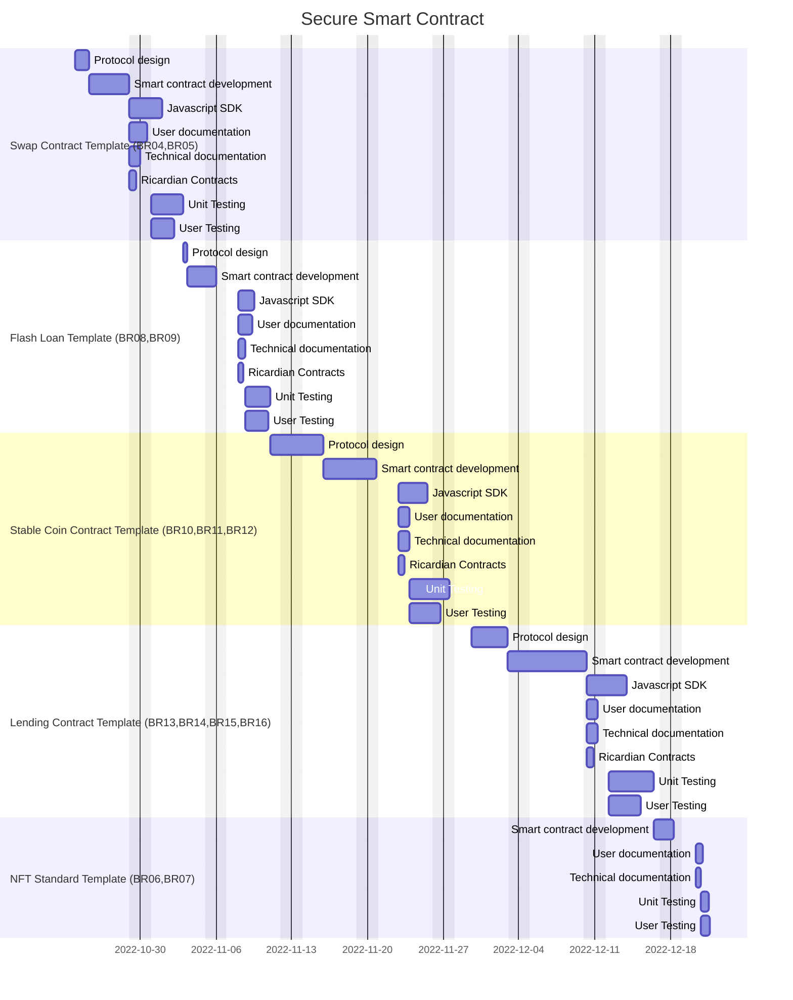

# Secure Smart Contract library (SSC)

```mermaid
gantt
    dateFormat  YYYY-MM-DD
    title       Secure Smart Contract
    excludes    weekends

    section Swap Contract Template (BR04,BR05)
    Protocol design                     :protocol1, 2022-10-24,30h
    Smart contract development          :dev1, after protocol1, 90h
    Javascript SDK                      :after dev1, 50h
    User documentation                  :after dev1, 40h
    Technical documentation             :docs1, after dev1, 25h
    Ricardian Contracts                 :after dev1, 15h
    Unit Testing                        :testing1, after docs1, 70h
    User Testing                        :after docs1, 50h

    section Flash Loan Template (BR08,BR09)
    Protocol design                     :protocol2, after testing1, 10h
    Smart contract development          :dev2, after protocol2, 65h
    Javascript SDK                      :after dev2, 35h
    User documentation                  :after dev2, 30h
    Technical documentation             :docs2, after dev2, 16h
    Ricardian Contracts                 :after dev2, 10h
    Unit Testing                        :testing2, after docs2, 55h
    User Testing                        :after docs2, 50h

    section Stable Coin Contract Template (BR10,BR11,BR12)
    Protocol design                     :protocol3, after testing2, 70h
    Smart contract development          :dev3, after protocol3, 117h
    Javascript SDK                      :after dev3, 65h
    User documentation                  :after dev3, 25h
    Technical documentation             :docs3, after dev3, 25h
    Ricardian Contracts                 :after dev3, 15h
    Unit Testing                        :testing3, after docs3, 90h
    User Testing                        :after docs3, 70h

    section Lending Contract Template (BR13,BR14,BR15,BR16)
    Protocol design                     :protocol4, after testing3, 80h
    Smart contract development          :dev4, after protocol4, 127h
    Javascript SDK                      :after dev4, 65h
    User documentation                  :after dev4, 25h
    Technical documentation             :docs4, after dev4, 25h
    Ricardian Contracts                 :after dev4, 15h
    Unit Testing                        :testing4, after docs4, 100h
    User Testing                        :after docs4, 70h

    section NFT Standard Template (BR06,BR07)
    Smart contract development          :dev5, after testing4, 45h
    User documentation                  :after dev5, 15h
    Technical documentation             :docs5, after dev5, 11h
    Unit Testing                        :testing5, after docs5, 17h
    User Testing                        :after docs5, 20h
```
